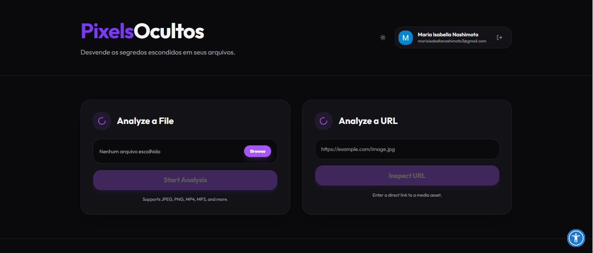
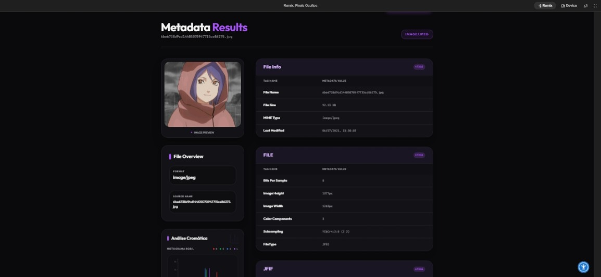
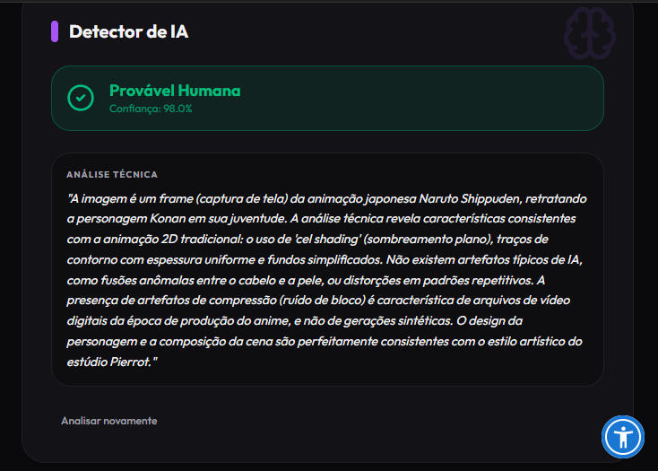

# 🔍 Pixels Ocultos: Advanced Metadata & Media Forensics Dashboard


## 📝 Descrição do Projeto
O **Pixels Ocultos** é uma ferramenta forense digital poderosa projetada para extrair, analisar e visualizar camadas invisíveis de informações em arquivos de mídia. Especializado no processamento de metadados profundos, o sistema permite que investigadores, fotógrafos e entusiastas de segurança identifiquem a procedência, os parâmetros técnicos e até mesmo manipulações em imagens e arquivos de áudio.

Utilizando motores de extração de alto desempenho como o **ExifReader** e análise de cor via **ColorThief**, a plataforma decompõe arquivos para revelar dados de geolocalização (GPS), especificações de hardware da câmera, perfis de cores e tags XMP/IPTC que normalmente permanecem ocultas ao usuário comum.

---

*Figura 1: Interface principal do Pixels Ocultos com análise de imagem e painel de metadados.*

## 🚀 Tecnologias Utilizadas
* **Frontend:** React 19 + TypeScript + Vite
* **Inteligência Artificial:** Google Gemini AI (Detecção assistida de anomalias e análise visual)
* **Estilização:** Tailwind CSS 4 (Custom Theme & Shadow Effects)
* **Backend & Auth:** Firebase (Google Authentication & Firestore para Histórico)
* **Extração de Dados:** ExifReader (Imagens) + Music-Metadata (Áudio)
* **Análise Visual:** ColorThief (Histogramas de cor) + D3.js (Visualização de dados)
* **Exportação:** jsPDF + AutoTable (Relatórios técnicos automatizados)

## 📊 Resultados e Funcionalidades
O projeto foi estruturado para fornecer uma auditoria completa de arquivos digitais:
* **Extração Profunda (Full EXIF):** Leitura exaustiva de metadados, incluindo coordenadas GPS com integração direta para visualização de localidade.
* **Detecção Assistida por IA:** Integração com Gemini AI para análise de conteúdo, identificação de objetos e sugestões de autenticidade baseadas em contexto visual.


*Figura 2: Detalhamento técnico de metadados e histograma de cores dominantes.*

* **Histogramas de Cor Dinâmicos:** Visualização da paleta dominante e distribuição cromática para análise de composição e possíveis edições.
* **Histórico de Análise Persistente:** Sincronização em tempo real via Firestore, permitindo que usuários autenticados acessem auditorias passadas de qualquer dispositivo.
* **Relatórios PDF Profissionais:** Geração instantânea de documentação técnica contendo todos os metadados extraídos para fins de arquivamento ou investigação.


*Figura 3: Auditoria assistida por IA identificando anomalias e descrevendo o contexto da cena.*

## 🔧 Como Executar
1. Clone o repositório.
2. Certifique-se de ter as variáveis de ambiente configuradas no arquivo `.env` (ex: `GEMINI_API_KEY`).
3. O Firebase será inicializado automaticamente através do arquivo `firebase-applet-config.json`.
4. Instale as dependências:
   ```bash
   npm install
   ```
5. Execute o servidor de desenvolvimento:
   ```bash
   npm run dev
   ```

---
[Voltar ao início](https://github.com/mariaisabellanashimoto1-dot/portfolio-maria-isabella-nashimoto-de-andrade)
