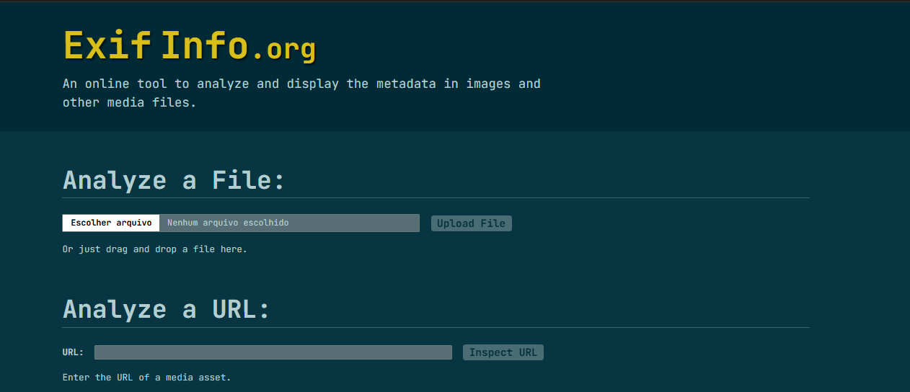
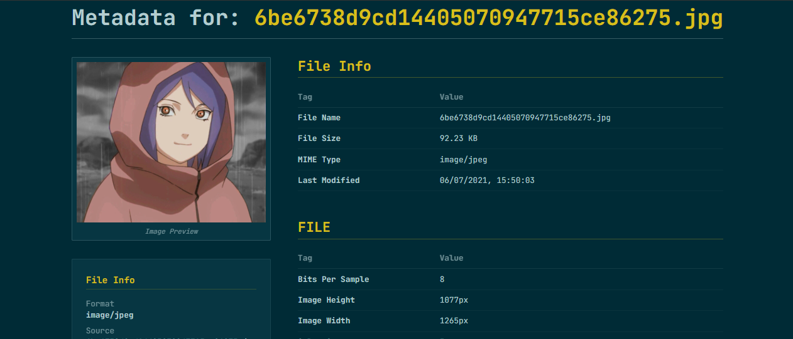

# 👁️ ExifInfo: Análise Profissional de Metadados de Mídia

## 📝 Descrição do Projeto
O **ExifInfo** é uma ferramenta de alta performance para extração e análise detalhada de metadados de arquivos de mídia (imagens, áudio e vídeo). Inspirado no design utilitário do *exifinfo.org*, o projeto utiliza uma paleta de cores baseada no esquema **Solarized Dark**, proporcionando uma experiência técnica, focada e de baixa fadiga visual para profissionais que lidam com integridade de dados e perícia digital.

Diferente de ferramentas server-side, o ExifInfo prioriza a **privacidade**, processando arquivos diretamente no navegador do usuário utilizando bibliotecas de baixo nível, garantindo que dados sensíveis de localização (GPS) ou autor não deixem a máquina local sem necessidade.

---

*Figura 1: Interface de análise com suporte a diversos grupos de tags (EXIF, XMP, IPTC, JFIF).*

## 🚀 Tecnologias Utilizadas
* **Frontend:** React 19 + TypeScript + Vite
* **Estilização:** Tailwind CSS (Custom Solarized Theme)
* **Extração de Metadados:** ExifReader (Imagens/Raw) + Music-Metadata (Áudio/Vídeo)
* **Backend Proxy:** Express (Utilizado para contornar restrições de CORS em análises via URL)
* **Ícones:** Lucide React
* **Animações:** Motion (Transições fluidas entre estados de upload e resultados)

## 📊 Resultados e Funcionalidades
O projeto foi estruturado para ser uma ferramenta de diagnóstico rápida e precisa:
* **Suporte Universal de Imagem:** Extração de metadados de formatos JPEG, PNG, TIFF, HEIC e diversos formatos RAW de câmeras profissionais.
* **Métricas Geográficas:** Decodificação de coordenadas GPS integradas com links de referência (quando presentes no arquivo).
* **Análise de Mídia Complexa:** Extração de bitrate, duração e containers de arquivos MP3, MP4 e WAV via processamento de buffer.
* **Privacidade Local:** Processamento de arquivos via `FileReader` e `ArrayBuffer`, eliminando o upload desnecessário para servidores externos.
* **Visualizador de Thumbnail:** Recuperação de miniaturas embutidas (`Embedded Thumbnails`) para visualização rápida sem carregar o arquivo em resolução total.

*Figura 2: Detalhamento de grupos técnicos e visualização de megapixels calculados em tempo real.*

## 🔧 Como Executar
1. Clone o repositório.
2. Instale as dependências: `npm install`.
3. Certifique-se de que as variáveis de ambiente (se necessárias para o proxy) estão configuradas.
4. Execute o servidor de desenvolvimento: `npm run dev`.
5. Abra o navegador em `http://localhost:3000`.

---
[Voltar ao início](https://github.com/mariaisabellanashimoto1-dot/portfolio-maria-isabella-nashimoto-de-andrade)
